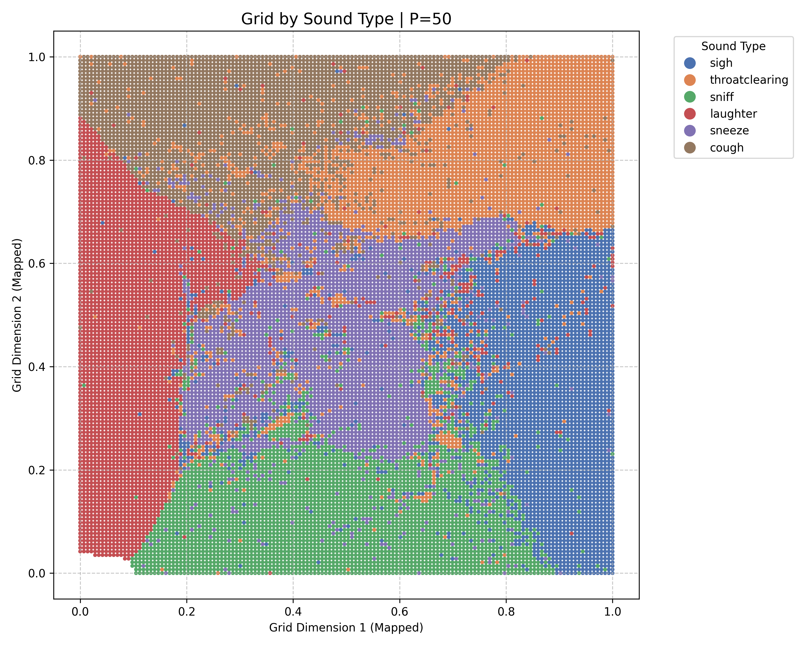

# Human Health Sounds
An interactive visualization to organize thousands of human health sounds via t-SNE


## About

Human health sounds — like coughing, sneezing, wheezing, and laughing — carry valuable diagnostic information. These sounds vary widely across individuals but can offer deep insights into respiratory and overall health.

An understanding of these sounds, based solely on their auditory properties, can provide an effective tool for healthcare. For instance, a model can compare an individual's throat clearing sound to typical patterns of throat clearing for healthy populations to potentially diagnose an illness.

A first step towards understanding health sounds involves clustering them. This experiment uses machine learning to organize thousands of human health sounds among six classes: cough, sneeze, sniff, sigh, throatclearing, laughter. We use VocalSound as our open-source health dataset. This visualization is built entirely through *unsupervised* learning. The model was not given any labels (like sound type or speaker information). Rather, using a technique called t-SNE, the computer created this map purely on acoustic features, and we can observe that similar sounds are placed closer together.

The project provides an interactive grid visualization of clustered audio clips. Users can click on images to view metadata, click and drag to play several related clips simultaneously, and filter by metadata to discover patterns.

The project can be viewed from the following link: [https://hishambhatti.github.io/ca-cough-ony](https://hishambhatti.github.io/human-health-sounds)

## Usage

Here we describe the basic pipeline for transforming raw audio files into an effective visualization. If you want to create a similar visualization for a different audio dataset, follow these instructions with a different audio folder.

```
human-health-sounds/
├── backend/
│   ├── Audio_Processing.ipynb
│   ├── HeAR_embeddings.ipynb
│   └── t-SNE_and_grid_clustering.ipynb
├── ca-cough-ony/  # React frontend
│   ├── public/
│   ├── src/
│   └── package.json
├── requirements.txt
└── README.md
```

### Backend Setup (Python)

To build the backend Python, first create a virtual environment and install the required dependencies.

Some commands to create a virtual environment

```
python3 -m venv .venv source
.venv/bin/activate
pip install -r requirements.txt
```

After installing dependencies, run the following notebooks *in order*, modifying the folder name for audio data:

First, save your dataset locally. In our example, we have a source directory `vs_release_16k/audio_16k`.

1. **Audio_Preprocessing.ipynb**: Run the cells for `Pre-Processing`
- Pre-processes the human health audio data to create audio suitable for the HeAR model
- Trims silence, removes short/quiet files, and caps the length of clip
- Creates spectrograms for each audio clip

2. **HeAR_embeddings.ipynb**
- Uses Google’s HeAR model (via Hugging Face) to generate embeddings
- Tests embeddings on the preprocessed data

3. **t-SNE_and_grid_clustering.ipynb**
- Runs the t-SNE algorithm to cluster the HeAR embeddings, searching over various perplexities
- Runs the LAP solver to convert the t-SNE output into a 2D grid
- Saves the output as a JSON for the frontend visualization

4. **Audio_Preprocessing.ipynb**: Run the cells for `Post-Processing`
- Arranges spectrograms into a single large grid for frontend visualization
- Combines individual audio clips into a single file, adding start and end times in metadata

### Frontend Setup (React)

To build the client-side React, make sure you are in the `ca-cough-ony` folder. Then install node and run `npm install`.

Place the generated JSON file (either `vocalsound_wav.json` or `vocalsound_mp3.json`) into the `ca-cough-ony/src` folder. Copy the spectrogram grid (`precomposed_grid_32.png`) and the audio file (`all_sounds_combined.wav` or `all_sounds_combined.mp3`) and processed audio folders into the`public/`directory. Then run:

`npm run dev`

## Results

Below is a visualization of our generated t-SNE cloud and LAP 2D grid for the processed VocalSound audio clips

|  |  |
| :---: | :---: |

As you can see, sound types are generally clustered together. The misgroupings often come from mislabelings in VocalSound, or poor audio quality. Feel free to explore them yourself!

## Credit

Developed by [Hisham Bhatti](https://www.linkedin.com/in/hisham-bhatti), working with [Zhihan Zhang](https://homes.cs.washington.edu/~zzhihan), at the [Ubiquitous Computing Lab](https://ubicomplab.cs.washington.edu) in the University of Washington [Paul G. Allen School of Computer Science & Engineering](https://www.cs.washington.edu).

This project was based on [Bird Sounds](https://experiments.withgoogle.com/ai/bird-sounds/view) at Google Creative Lab, but designed with modern tooling, and for others to test with their own datasets. In particular, below are some notebooks that I took inspiration from:

* [Generating Spectrograms](https://github.com/kylemcdonald/AudioNotebooks/blob/master/Generating%20Spectrograms.ipynb)
* [train_data_efficient_classifier](https://github.com/Google-Health/hear/blob/master/notebooks/train_data_efficient_classifier.ipynb)
* [Fingerprints to t-SNE](https://github.com/kylemcdonald/AudioNotebooks/blob/master/Fingerprints%20to%20t-SNE.ipynb)
* [CloudToGrid](https://github.com/kylemcdonald/CloudToGrid)

The core embedding model is Google’s HeAR model, available on [Hugging Face](https://huggingface.co/google/hear)

The dataset used is [VocalSound](https://github.com/YuanGongND/vocalsound), an open-source collection of human health sounds.

## Built With

**Backend**:
[](#)


**Frontend**:
[](#)
[](#)
[](#)

**Frameworks**:
[](#)
[](#)
[](#)
[](#)

**Libraries**:
[](#)
[](#)
[](#)


**Tools**:
[](#)
